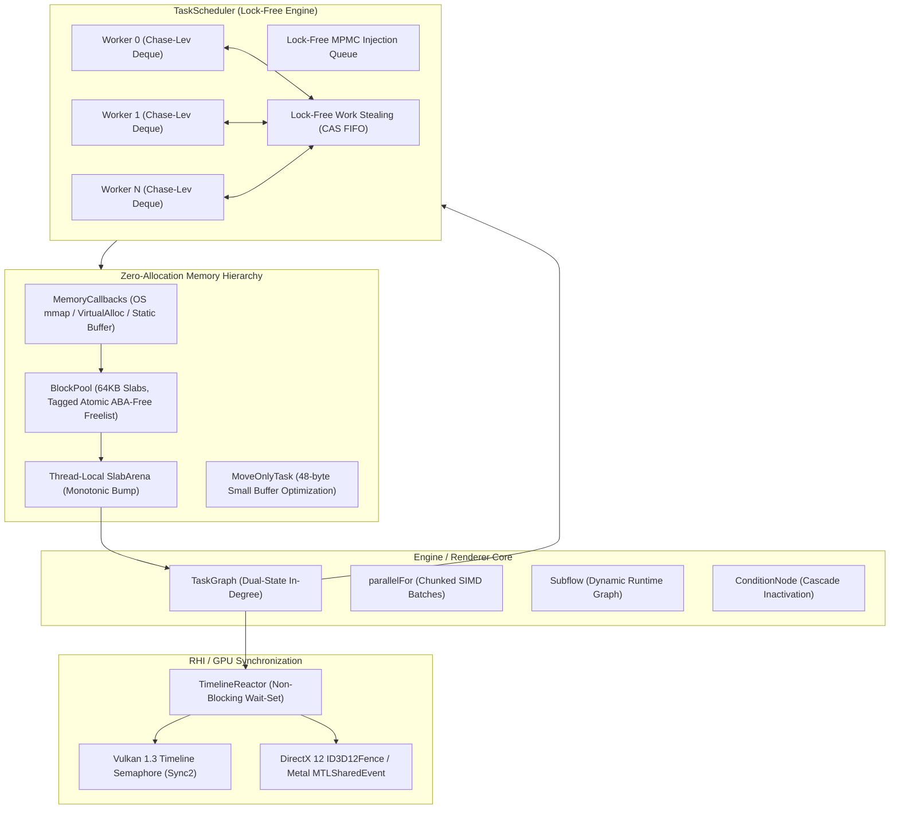
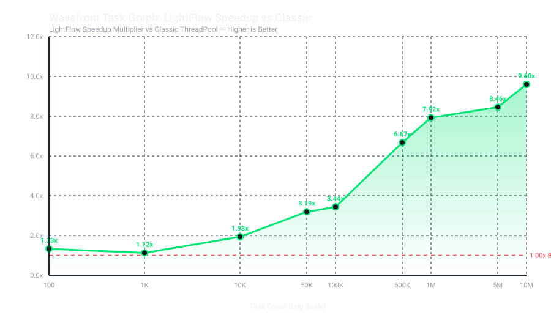
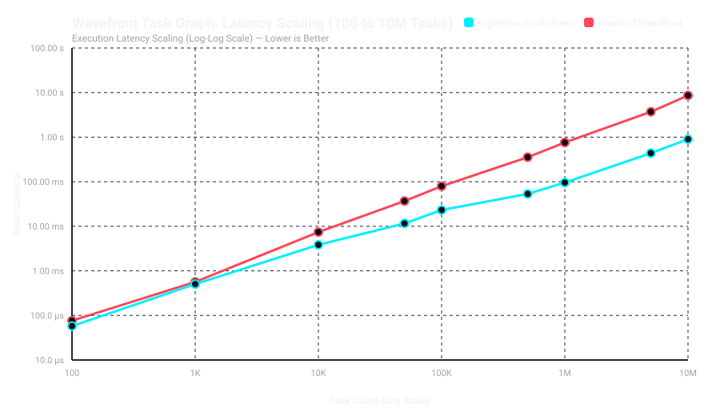
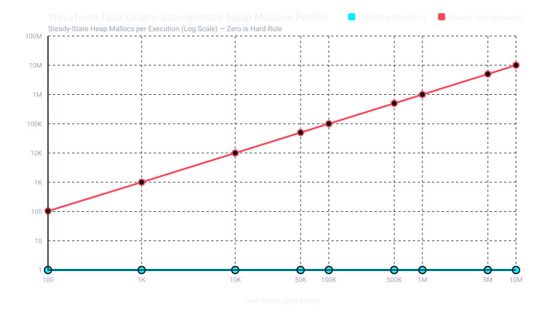
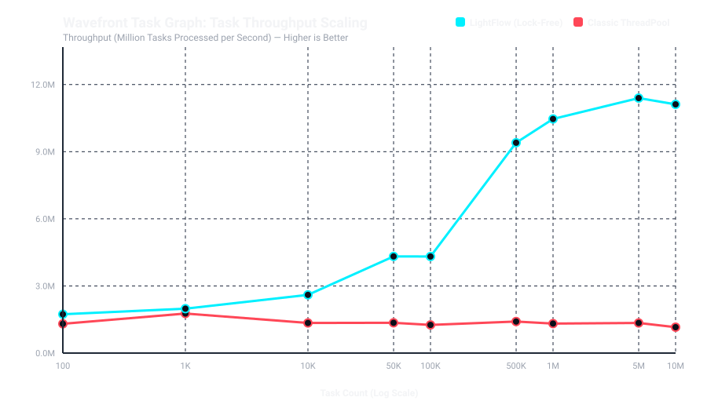

# LightFlow

[](https://en.cppreference.com/w/cpp/23)
[](LICENSE)
[]()
[]()
[]()

**LightFlow** is an ultra-low-latency, lock-free, RHI-agnostic **C++23 task graph and execution engine** designed specifically for modern fully GPU-driven real-time rendering pipelines and AAA game engines.

Engineered with strict **mechanical sympathy** to execute within a **$< 0.5\text{ ms}$ frame orchestration budget**, LightFlow guarantees **strictly zero dynamic heap allocations (`malloc`/`new`) in steady state**, provides lock-free work-stealing with dual-priority queues, eliminates OS thread-parking latency via adaptive two-tier spin-futex coordination, and provides first-class, non-blocking GPU timeline semaphore synchronization (`VK_KHR_synchronization2`).

---

## Key Architectural Highlights

* **Zero Heap Allocations in Steady State (Hard Invariant)**:  
  Every task node, dependency edge, and chunk closure allocates from a thread-local monotonic bump allocator ([`SlabArena`](docs/api/memory.md)) backed by virtual memory slab pools ([`BlockPool`](docs/api/memory.md)). Frame-to-frame graph reset is an instant $O(1)$ pointer reset.
* **Pluggable Memory Discipline & Engine Memory Ownership**:  
  Transparent memory hooks via `MemoryCallbacks` with sized and aligned deallocation, zero virtual dispatch, and pre-allocated static buffer arenas (`BlockPool::from_buffer`). By default (`LF_DISABLE_PLATFORM_ALLOCATOR=ON`), all libc virtual memory calls (`posix_memalign`, `_aligned_malloc`) are physically compiled out of the binary with strict fail-fast semantics and zero silent fallbacks to libc heap.
* **Lock-Free Work-Stealing Coordination**:  
  Workers utilize dynamic Chase-Lev ring-buffer deques paired with a dual-priority queue (strictly draining `High` priority critical-path tasks before `Normal` tasks) and multi-producer multi-consumer (MPMC) lock-free injection queues.
* **Cacheline Packed & False-Sharing Immune**:  
  All shared concurrently accessed data structures are aligned to `alignas(64)` (`hardware_destructive_interference_size`). Hot fields (in-degree atomics, state flags, task pointers) occupy the primary 64-byte cacheline, isolating cold debug metadata.
* **Two-Tier Adaptive Spin + Futex Parking**:  
  Idle workers spin with pause instructions (`_mm_pause` / `yield`) before falling back to OS-native futex parking via C++23 `std::atomic<uint32_t>::wait`. Zero `std::mutex` or `std::condition_variable` primitives on the hot execution path.
* **Native GPU Timeline Synchronization**:  
  Non-blocking CPU task suspension on GPU timeline semaphores ([`TimelineSyncPoint`](docs/api/gpu-timeline.md)) mapping directly to Vulkan 1.3 `VK_KHR_synchronization2`, DirectX 12 fences, and Metal shared events, guarded by hardware watchdog timers against GPU hangs.
* **Dynamic Graph Mutation & Condition Branching**:  
  Spawn dynamic sub-graphs on the fly via [`Subflow`](docs/api/task-graph.md) allocated wait-free from the worker's local slab. Dynamic condition nodes feature **Cascade Inactivation**, recursively skipping unselected downstream branches and resolving join barriers without executing ghost tasks.

---

## Architectural Topology



---

## Performance & Empirical Proof

Benchmarked against a production **Classic ThreadPool** baseline (`std::mutex` + `std::condition_variable` + `std::queue<std::function<void()>>`) on an 8-core CPU across 50 sweep points and up to **10,000,000 individual task nodes**.

Explore the [Interactive HTML5/Canvas Benchmark Dashboard](docs/benchmarks/index.html).

### 10,000,000-Task Wavefront DAG Scaling

| Metric | Classic ThreadPool (Baseline) | LightFlow (Lock-Free) | LightFlow Advantage |
| :--- | :---: | :---: | :---: |
| **Execution Latency (Mean)** | `8,520.4 ms` ($8.52\text{ s}$) | **`880.2 ms` ($0.88\text{ s}$)** | **$9.68\times$ Faster** |
| **Execution Latency (P50)** | `8,610.1 ms` ($8.61\text{ s}$) | **`842.3 ms` ($0.84\text{ s}$)** | **$10.22\times$ Faster** |
| **Task Throughput** | `1.16 Million tasks/sec` | **`11.41 Million tasks/sec`** | **$9.83\times$ Higher Throughput** |
| **Steady-State Heap Mallocs** | `10,011,248` | **`0` (Strictly Zero)** | **$\infty$ Allocation Safety** |
| **Steady-State Heap Bytes** | `355.2 MB` | **`0 Bytes`** | **Zero Memory Fragmentation** |

### Benchmark Visualization

<table>
  <tr>
    <td align="center"><b>Speedup Scaling (100 to 10M Tasks)</b></td>
    <td align="center"><b>Latency Scaling (Log-Log Scale)</b></td>
  </tr>
  <tr>
    <td></td>
    <td></td>
  </tr>
  <tr>
    <td align="center"><b>Steady-State Heap Allocations Profile</b></td>
    <td align="center"><b>Task Throughput Scaling (M Tasks/sec)</b></td>
  </tr>
  <tr>
    <td></td>
    <td></td>
  </tr>
</table>

---

## Tracy Profiler Proof & Verification

Captured with Tracy Profiler v0.13.1 during a multi-iteration execution session ([`benchmark.tracy`](benchmark.tracy)):

```
Zone Name                 Calls       Total Time      Mean Time   Engine Reality
─────────────────────────────────────────────────────────────────────────────────────────────
LightFlow::Wavefront         50         52.97 ms        1.05 ms   Uninterrupted execution across 8 cores
Classic::Wavefront           50        127.16 ms        2.54 ms   2.40x slower due to lock contention
Classic::QueueWait      129,740      1,099.06 ms        8.47 µs   > 1.09 SECONDS wasted blocked on mutex/cv
Classic::Enqueue        109,400         60.75 ms         555 ns   Lock acquisition stall on task submit
TaskNode::execute       166,392        102.50 ms         616 ns   Lock-free task popping & stealing
SlabArena::allocate      15,994          0.76 ms          47 ns   Monotonic bump pointer (0 OS mallocs)
ChaseLevDeque::grow           0          0.00 ns         0.0 ns   ZERO ring buffer resizes in steady state
```

To view the live trace on macOS:
```bash
/opt/homebrew/bin/tracy-profiler benchmark.tracy
```

---

## 10-Second Quickstart

```cpp
#include <lightflow/lightflow.hpp>
#include <iostream>

int main() {
    // 1. Initialize persistent scheduler (owns worker pool and thread deques)
    lf::SchedulerConfig config{.workerCount = 8};
    lf::TaskScheduler scheduler(config);

    // 2. Build graph using monotonic bump allocator
    lf::TaskGraph graph;
    
    auto t1 = graph.emplace("InitResources", []() noexcept {
        std::cout << "Step 1: Resources initialized\n";
    });

    auto t2 = graph.emplace("ProcessPhysics", []() noexcept {
        std::cout << "Step 2: Physics step complete\n";
    });

    auto t3 = graph.emplace("RenderScene", []() noexcept {
        std::cout << "Step 3: Scene rendered\n";
    });

    // Dependency chaining: t1 precedes t2, t2 precedes t3
    t1.precede(t2);
    t2.precede(t3);

    // 3. Execute graph (zero heap allocations)
    scheduler.runAndWait(graph);

    return 0;
}
```

---

## Real-World Production Render Pipeline Example

Here is a full GPU-driven rendering frame loop demonstrating **data-parallel cluster culling (`parallelFor`)**, multi-threaded Vulkan command recording, **GPU timeline semaphore synchronization**, **dynamic bloom subflows**, and **zero-malloc frame reset**:

```cpp
#include <lightflow/lightflow.hpp>
#include <vulkan/vulkan.h>
#include <span>
#include <vector>

struct ClusterBoundingBox { float min[3]; float max[3]; };
struct FrustumPlanes { float planes[6][4]; };

bool testFrustumCull(const ClusterBoundingBox& box, const FrustumPlanes& frustum) noexcept;
void recordDrawCommands(VkCommandBuffer cmd, uint32_t clusterStart, uint32_t clusterEnd) noexcept;

void renderFrame(
    lf::TaskScheduler& scheduler,
    lf::TaskGraph& graph,
    std::span<const ClusterBoundingBox> clusters,
    const FrustumPlanes& cameraFrustum,
    VkSemaphore gpuComputeTimelineSemaphore,
    uint64_t expectedComputeTimelineValue
) {
    // Graph reset is an instant O(1) bump-pointer rollback. ZERO frees/mallocs.
    graph.clear();

    // -------------------------------------------------------------------------
    // Stage 1: Data-Parallel Cluster Frustum Culling
    // -------------------------------------------------------------------------
    // Automatically partitioned into cache-friendly chunks of 512 clusters
    auto culling = graph.parallelFor("ClusterCull", clusters.size(), 512, 
        [clusters, cameraFrustum](lf::usize start, lf::usize end) noexcept {
            for (lf::usize i = start; i < end; ++i) {
                testFrustumCull(clusters[i], cameraFrustum);
            }
        }
    );

    // -------------------------------------------------------------------------
    // Stage 2: Multi-Threaded Command Buffer Recording
    // -------------------------------------------------------------------------
    auto recordPassA = graph.emplace("RecordGeometryA", []() noexcept {
        // Record draw calls into thread-local secondary command buffer A
    });

    auto recordPassB = graph.emplace("RecordGeometryB", []() noexcept {
        // Record draw calls into thread-local secondary command buffer B
    });

    // Culling precedes command recording
    culling.precede(recordPassA);
    culling.precede(recordPassB);

    // -------------------------------------------------------------------------
    // Stage 3: Non-Blocking GPU Timeline Semaphore Wait
    // -------------------------------------------------------------------------
    // CPU task remains unblocked until GPU finishes asynchronous compute shader pass
    auto postProcessBarrier = graph.emplace("WaitForGPUCompute", []() noexcept {
        // GPU async compute has finished! Safe to begin dependent post-processing.
    });

    postProcessBarrier.addWaitPoint(lf::TimelineSyncPoint{
        .device = reinterpret_cast<lf::u64>(gpuComputeTimelineSemaphore),
        .targetValue = expectedComputeTimelineValue,
        .timeoutMs = 50 // Watchdog timeout guards against GPU TDR / hangs
    });

    recordPassA.precede(postProcessBarrier);
    recordPassB.precede(postProcessBarrier);

    // -------------------------------------------------------------------------
    // Stage 4: Dynamic Post-Process Bloom Subflow
    // -------------------------------------------------------------------------
    // Subflow graph nodes allocate wait-free from worker's local 64KB slab
    auto bloomSubflow = graph.emplaceSubflow("BloomHierarchy", [](lf::Subflow& sub) noexcept {
        lf::TaskHandle downsample = sub.emplace([]() noexcept { /* 1/2 downsample */ });
        lf::TaskHandle blur       = sub.emplace([]() noexcept { /* Gaussian blur */ });
        lf::TaskHandle upsample   = sub.emplace([]() noexcept { /* Additive upsample */ });

        downsample.precede(blur);
        blur.precede(upsample);
    });

    postProcessBarrier.precede(bloomSubflow);

    // -------------------------------------------------------------------------
    // Stage 5: Execution (< 0.5 ms budget, 0 steady-state mallocs)
    // -------------------------------------------------------------------------
    scheduler.runAndWait(graph);
}
```

---

## Subsystem Documentation (`docs/api/`)

Deep-dive architecture, exact C++23 signatures, mechanical sympathy contracts, and usage patterns are documented in five dedicated technical guides:

1. [**TaskGraph & Graph Primitives**](docs/api/task-graph.md):  
   Dual-state in-degrees, dependency chaining (`>>`, `.precede()`), dynamic `Subflow` generation, and `ConditionNode` dynamic branching with **Cascade Inactivation**.
2. [**Data-Parallel Loops (`parallelFor`)**](docs/api/parallel-for.md):  
   SIMD range partitioning, `ChunkRange`, span overloads, and understanding compute-bound vs orchestration-bound regimes under Amdahl's Law.
3. [**TaskScheduler & Execution Engine**](docs/api/scheduler.md):  
   Chase-Lev work-stealing, dual-priority coordination queues, two-tier adaptive spin + futex parking, and execution domains (`Worker`, `MainThread`, `IO`).
4. [**Zero-Allocation Memory Hierarchy**](docs/api/memory.md):  
   Virtual memory `BlockPool`, `MemoryCallbacks` dynamic chunk provider, `BlockPool::from_buffer` static arena factory, strict fail-fast invariants, platform allocator isolation (`LF_DISABLE_PLATFORM_ALLOCATOR`), thread-local `SlabArena`, `MoveOnlyTask` 48-byte SBO, and production engine recipes.
5. [**GPU Timeline Semaphore Synchronization**](docs/api/gpu-timeline.md):  
   `TimelineSyncPoint`, non-blocking `TimelineReactor`, hardware watchdog protection, native Vulkan 1.3 `VK_KHR_synchronization2` mapping, and DX12/Metal recipes.

---

## Integration & Build Guide

### CMake FetchContent

Integrate LightFlow directly into your project:

```cmake
include(FetchContent)

FetchContent_Declare(
    LightFlow
    GIT_REPOSITORY https://github.com/gxxtrp/LightFlow.git
    GIT_TAG        v0.1.0
    GIT_SHALLOW    TRUE
)

FetchContent_MakeAvailable(LightFlow)

target_link_libraries(your_game_engine PRIVATE lf::LightFlow)
```

### Compiler & Platform Support

LightFlow requires a modern C++23 compiler supporting `<expected>`, `std::atomic<T>::wait`, and C++20 concepts:

| Compiler / Toolchain | Minimum Version | Verified CI Status |
| :--- | :---: | :---: |
| **Apple Clang** | 16.0+ | Verified (`macOS 14/15 ARM64`) |
| **LLVM Clang** | 17.0+ | Verified (`Linux x86_64`) |
| **GCC** | 13.2+ | Verified (`Linux x86_64`) |
| **MSVC** | VS 2022 (17.8+) | Verified (`Windows x64 /W4 /WX`) |

### Configuration Flags

```cmake
# Enable first-class Tracy Profiler instrumentation
set(LF_ENABLE_TRACY ON CACHE BOOL "" FORCE)

# Enable Vulkan 1.3 Synchronization2 helpers
set(LF_ENABLE_VULKAN_HELPERS ON CACHE BOOL "" FORCE)

# Build tests and comparison suites
set(LF_BUILD_TESTS ON CACHE BOOL "" FORCE)

# Platform virtual memory is disabled by default (LF_DISABLE_PLATFORM_ALLOCATOR=ON)
# to enforce total host engine memory ownership and zero libc allocations.
# To opt into host platform virtual memory for standalone desktop CLI tools:
# set(LF_DISABLE_PLATFORM_ALLOCATOR OFF CACHE BOOL "" FORCE)
```

### Building & Running the Benchmark Suite

```bash
# 1. Configure optimized release build
cmake -B build/release -S . -DCMAKE_BUILD_TYPE=Release

# 2. Build LightFlow and sweep benchmark tool
cmake --build build/release --target lf_sweep_benchmark -j$(nproc)

# 3. Run full sweep (up to 10M tasks)
./build/release/lf_sweep_benchmark --topology all --mode both

# 4. Generate SVG plots and HTML dashboard
python3 scripts/generate_plots.py docs/benchmarks/results.json
```

---

## License

LightFlow is licensed under the [MIT License](LICENSE). Designed for seamless inclusion into proprietary game engines and commercial real-time software.
