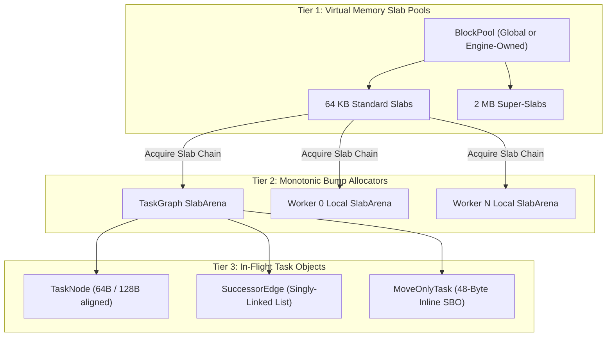

# Zero-Allocation Memory Hierarchy API Reference

LightFlow enforces a hard systems invariant: **strictly zero dynamic heap allocations (`malloc`, `new`, `free`, `delete`, `std::make_unique`) on the steady-state frame loop**.

Memory is managed through a high-performance **3-tier memory hierarchy** optimized for cache locality and instant $O(1)$ monotonic rollback.

---

## 3-Tier Memory Architecture



### 1. Tier 1: Virtual Memory `BlockPool`
The [`BlockPool`](../../include/lightflow/core/memory_pool.hpp) acts as a centralized, thread-safe reservoir of contiguous memory slabs (default: 64 KB slabs, 2 MB super-slabs). It manages slab acquisition and reclamation. Slabs are never freed to the OS during frame execution; they are recycled in a concurrent free-list.

### 2. Tier 2: Monotonic Bump `SlabArena`
The [`SlabArena`](../../include/lightflow/core/slab_arena.hpp) provides lock-free, wait-free pointer-bump allocation.
* **Fast Path (Inline Pointer Bump)**:  
  `currentOffset + size <= slabCapacity`. Allocation takes **$~40\text{ ns}$** (a single pointer addition).
* **Slow Path (Slab Chaining)**:  
  When a 64 KB slab is exhausted, the arena acquires a new slab from the `BlockPool` and links it into an intrusive singly-linked chain.
* **Reset**:  
  Calling `reset()` rolls the bump pointer back to byte 0 in $O(1)$. Slabs remain attached for the next frame, eliminating all subsequent slab acquisitions.

### 3. Tier 3: `MoveOnlyTask` (48-Byte SBO)
Standard `std::function` allocates on the heap if captures exceed 16–24 bytes. LightFlow completely replaces `std::function` with [`MoveOnlyTask`](../../include/lightflow/task/move_only_task.hpp):
* Fixed **48-byte Small Buffer Optimization (SBO)** inline storage.
* Non-copyable (move-only), preserving unique resource ownership (e.g. `std::unique_ptr`, Vulkan handles).
* Captures exceeding 48 bytes automatically allocate inside the graph's `SlabArena`, **never on the OS heap**.

---

## Class Reference: `BlockPool`

```cpp
namespace lf {

class BlockPool {
public:
    explicit BlockPool(
        usize slabSize = 65536,        // 64 KB
        usize superSlabSize = 2097152   // 2 MB
    );
    ~BlockPool();

    /// Returns the global default BlockPool instance.
    static BlockPool& global() noexcept;

    /// Acquires a clean 64KB slab from the free-list or virtual memory.
    Slab* acquire_slab();

    /// Returns a linked chain of slabs back to the pool free-list.
    void release_slab_chain(Slab* chain);

    /// Total virtual memory allocated from the OS in bytes.
    usize totalAllocatedBytes() const noexcept;

    /// Number of cached slabs currently sitting idle in the pool.
    usize pooledSlabCount() const noexcept;
};

} // namespace lf
```

---

## Class Reference: `SlabArena`

```cpp
namespace lf {

class SlabArena {
public:
    explicit SlabArena(BlockPool& pool = BlockPool::global());
    ~SlabArena() noexcept;

    SlabArena(const SlabArena&) = delete;
    SlabArena& operator=(const SlabArena&) = delete;
    SlabArena(SlabArena&& other) noexcept;
    SlabArena& operator=(SlabArena&& other) noexcept;

    /// Constructs an object of type T directly inside the arena.
    template <typename T, typename... Args>
    T* create(Args&&... args);

    /// Allocates an aligned contiguous slice of Ts.
    template <typename T>
    std::span<T> allocate_span(usize count);

    /// Raw bump allocation with explicit alignment.
    void* allocate(usize bytes, usize alignment = alignof(std::max_align_t));

    /// Instantaneous O(1) rollback of all allocations.
    void reset() noexcept;
};

} // namespace lf
```

### Usage Example: Bump Allocating Objects

```cpp
lf::SlabArena arena;

// 1. Create individual objects (constructors called in-place)
auto* node = arena.create<lf::TaskNode>();

// 2. Allocate contiguous spans without std::vector overhead
std::span<uint32_t> indices = arena.allocate_span<uint32_t>(1024);

// 3. Reset all allocations instantaneously
arena.reset();
```

---

## Class Reference: `MoveOnlyTask`

```cpp
namespace lf {

class MoveOnlyTask {
public:
    constexpr MoveOnlyTask() noexcept = default;
    ~MoveOnlyTask() noexcept;

    MoveOnlyTask(const MoveOnlyTask&) = delete;
    MoveOnlyTask& operator=(const MoveOnlyTask&) = delete;
    MoveOnlyTask(MoveOnlyTask&& other) noexcept;
    MoveOnlyTask& operator=(MoveOnlyTask&& other) noexcept;

    template <typename F>
    MoveOnlyTask(F&& callable, SlabArena* overflowArena = nullptr);

    /// Invokes the wrapped callable.
    void operator()() const noexcept;

    /// Returns true if an invocable target is bound.
    explicit operator bool() const noexcept;
};

} // namespace lf
```

---

## Pluggable Engine Allocators

Game engines with proprietary virtual memory architectures (e.g., custom linear arenas, frame stack allocators) can bind their existing memory managers directly into LightFlow.

### Recipe: Supplying an Engine-Owned Memory Pool

```cpp
#include <lightflow/lightflow.hpp>

// 1. Instantiate an engine-owned BlockPool with customized slab sizing
class EngineRenderSubsystem {
public:
    EngineRenderSubsystem()
        // Configure 128KB slabs and 4MB super-slabs for large mesh passes
        : m_renderBlockPool(131072, 4194304) 
    {
    }

    void executeRenderGraph() {
        // 2. Pass the custom BlockPool directly to TaskGraph
        lf::TaskGraph frameGraph(&m_renderBlockPool);

        // All task nodes, edges, and subflows now allocate from m_renderBlockPool!
        buildFrameGraph(frameGraph);

        m_scheduler.runAndWait(frameGraph);

        // 3. Slabs recycle back into m_renderBlockPool
        frameGraph.clear();
    }

private:
    lf::BlockPool m_renderBlockPool;
    lf::TaskScheduler m_scheduler;
};
```

---

## Mechanical Sympathy & Cache Verification

All memory components strictly enforce cacheline alignment:

| Component | Alignment | Cacheline Purpose |
| :--- | :---: | :--- |
| `Slab` | `alignas(64)` | Ensures start of user payload begins on an independent L1 data line. |
| `TaskNode` | `alignas(64)` | Hot execution fields packed into byte 0–63; debug data isolated in byte 64–127. |
| `WorkerThreadContext` | `alignas(64)` | Eliminates false sharing between adjacent worker thread deques. |
| `MpmcTaskQueue` | `alignas(64)` | Isolates atomic head/tail counters from thread contention. |
