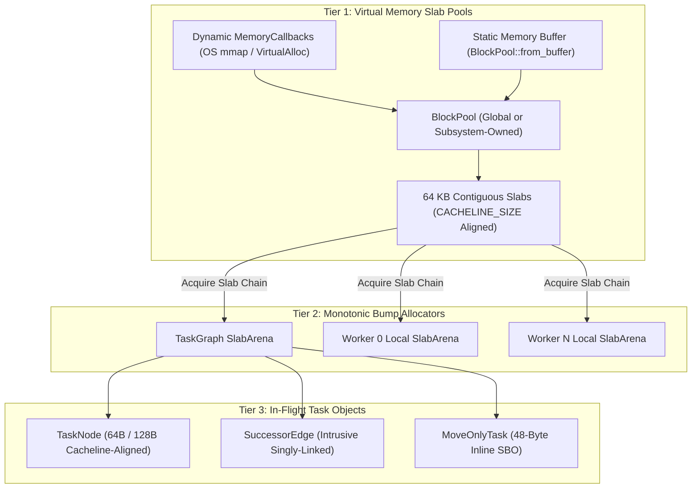

# Zero-Allocation Memory Hierarchy & Pluggable Allocator API Reference

LightFlow enforces a hard systems invariant: **strictly zero dynamic heap allocations (`malloc`, `new`, `free`, `delete`, `std::make_unique`) on the steady-state frame loop**.

Memory is managed through a high-performance **3-tier memory hierarchy** backed by a transparent, pluggable memory subsystem designed for modern game engines, custom virtual memory architectures, and console platforms.

---

## 3-Tier Memory Architecture



### 1. Tier 1: Virtual Memory `BlockPool`
The [`BlockPool`](../../include/lightflow/core/memory_pool.hpp) acts as a centralized, thread-safe reservoir of contiguous memory slabs (fixed 64 KB granularity). It operates through a unified allocation pipeline:
* **Dynamic Chunk Provider**: Routes chunk allocations and deallocations through user-configured `MemoryCallbacks` (or default platform memory).
* **Static Pre-Allocated Buffer**: Partitions fixed, pre-allocated memory spans via `BlockPool::from_buffer()` with non-owning semantics and permanently disabled growth.
* **ABA-Safe Lock-Free Freelist**: Slabs are acquired and recycled concurrently using 128-bit tagged pointer CAS (`TaggedSlab`). Slabs are never freed to the OS during frame loops.

### 2. Tier 2: Monotonic Bump `SlabArena`
The [`SlabArena`](../../include/lightflow/core/slab_arena.hpp) provides lock-free, wait-free pointer-bump allocation.
* **Fast Path (Inline Pointer Bump)**:  
  `currentOffset + size <= slabCapacity`. Allocation takes **$~40\text{ ns}$** (a single pointer addition).
* **Slow Path (Slab Chaining)**:  
  When a 64 KB slab is exhausted, the arena acquires a new slab from its backing `BlockPool` and links it into an intrusive singly-linked chain.
* **Instantaneous Reset**:  
  Calling `reset()` rolls the bump pointer back to byte 0 and releases chained slabs back to the pool in $O(1)$ via a single atomic CAS.

### 3. Tier 3: `MoveOnlyTask` (48-Byte SBO)
Standard `std::function` allocates on the heap if captures exceed 16–24 bytes. LightFlow completely replaces `std::function` with [`MoveOnlyTask`](../../include/lightflow/task/move_only_task.hpp):
* Fixed **48-byte Small Buffer Optimization (SBO)** inline storage.
* Move-only semantics, preserving unique resource ownership (e.g., `std::unique_ptr`, Vulkan handles, Metal buffers).
* Captures exceeding 48 bytes automatically allocate inside the graph's `SlabArena`, **never on the OS heap**.

---

## Struct Reference: `MemoryCallbacks`

```cpp
namespace lf {

struct MemoryCallbacks {
    using AllocFn = void* (*)(usize bytes, usize alignment, void* user_data) noexcept;
    using FreeFn = void (*)(void* ptr, usize bytes, usize alignment, void* user_data) noexcept;

    AllocFn alloc{nullptr};
    FreeFn free{nullptr};
    void* user_data{nullptr};

    LF_NODISCARD constexpr bool is_valid() const noexcept {
        return alloc != nullptr && free != nullptr;
    }
};

} // namespace lf
```

### Architectural Guarantees

1. **Zero Virtual Method Dispatch**:  
   Hooks use C-style function pointers instead of abstract C++ classes with virtual method tables (`vtable`). This guarantees zero virtual dispatch overhead, no cache-miss vtable lookups, binary stability across DLL boundaries, and full `-fno-rtti` compatibility.
2. **Sized & Aligned Deallocation**:  
   The deallocation callback receives the exact byte size (`bytes`) and alignment (`alignment`) supplied during allocation. This eliminates the need for tracking headers or hash map lookups, allowing engines to unmap virtual memory pages directly (`munmap`, `VirtualFree`).
3. **Stateful `user_data` Context**:  
   The `user_data` pointer is passed untouched to both callbacks, allowing integration with custom telemetry monitors, budget trackers, subsystem tags, or arena managers.
4. **Strict Pair Validation**:  
   Both `alloc` and `free` must be provided (`is_valid() == true`). Providing one without the other triggers an immediate `LF_ASSERT`.

---

## Platform Memory Callbacks

```cpp
#if !defined(LF_DISABLE_PLATFORM_ALLOCATOR)
namespace lf {
    LF_NODISCARD MemoryCallbacks platform_memory_callbacks() noexcept;
}
#endif
```

* **POSIX (Linux, macOS, BSD)**: Allocates via `posix_memalign` and deallocates via `free`.
* **Windows (MSVC, Clang-cl)**: Allocates via `_aligned_malloc` and deallocates via `_aligned_free`.
* **Unified Pipeline**: Platform memory is not a hidden backdoor; it is simply the default `MemoryCallbacks` instance used when no custom callbacks are configured.

---

## Class Reference: `BlockPool`

```cpp
namespace lf {

class alignas(CACHELINE_SIZE) BlockPool {
public:
    static constexpr usize DEFAULT_INITIAL_SLABS = 256; // 16 MB
    static constexpr usize DEFAULT_CHUNK_SLABS = 256;   // 16 MB

#if !defined(LF_DISABLE_PLATFORM_ALLOCATOR)
    explicit BlockPool(usize initial_slabs = DEFAULT_INITIAL_SLABS,
                       usize chunk_slabs = DEFAULT_CHUNK_SLABS,
                       bool allow_growth = true) noexcept;
#else
    explicit BlockPool(usize initial_slabs = 0,
                       usize chunk_slabs = DEFAULT_CHUNK_SLABS,
                       bool allow_growth = false) noexcept;
#endif

    explicit BlockPool(const MemoryCallbacks& callbacks,
                       usize initial_slabs = DEFAULT_INITIAL_SLABS,
                       usize chunk_slabs = DEFAULT_CHUNK_SLABS,
                       bool allow_growth = true) noexcept;

    ~BlockPool() noexcept;

    /// Returns the global default BlockPool instance.
    LF_NODISCARD static BlockPool& global() noexcept;

    /// Configures the global MemoryCallbacks used when BlockPool::global() is initialized.
    /// Must be called during engine bootstrap BEFORE BlockPool::global() is first accessed.
    /// Asserts (LF_ASSERT) if called after BlockPool::global() has already been initialized.
    static void set_global_callbacks(const MemoryCallbacks& callbacks) noexcept;

    /// Returns the global MemoryCallbacks configured for the engine bootstrap.
    LF_NODISCARD static const MemoryCallbacks& global_callbacks() noexcept;

    /// Returns true if BlockPool::global() has already been initialized.
    LF_NODISCARD static bool is_global_initialized() noexcept;

    /// Testing-only helper to destruct BlockPool::global() and reset global bootstrap state.
    static void reset_global_for_testing() noexcept;

    /// Creates a BlockPool backed by a pre-allocated static contiguous memory buffer.
    /// Non-owning semantics: the buffer memory is never deallocated on pool destruction.
    LF_NODISCARD static BlockPool from_buffer(void* buffer, usize bytes) noexcept;

    // Move constructible
    BlockPool(BlockPool&& other) noexcept;

    // Non-copyable, non-move-assignable
    BlockPool(const BlockPool&) = delete;
    BlockPool& operator=(const BlockPool&) = delete;
    BlockPool& operator=(BlockPool&&) = delete;

    /// Acquires a single 64KB slab from the pool freelist (lock-free fast path).
    LF_NODISCARD Slab* acquire_slab() noexcept;

    /// Releases a single slab back to the pool freelist (lock-free).
    void release_slab(Slab* slab) noexcept;

    /// Releases a linked chain of slabs (from head to tail) back to the freelist in O(1).
    void release_slab_chain(Slab* head, Slab* tail, usize count) noexcept;

    /// Returns the number of currently available slabs in the pool.
    LF_NODISCARD usize available_slabs() const noexcept;

    /// Returns the total number of slabs managed across all chunks.
    LF_NODISCARD usize total_slabs() const noexcept;

    /// Returns the number of contiguous virtual memory chunks currently allocated.
    LF_NODISCARD usize chunk_count() const noexcept;

    /// Returns the memory callbacks configured for this BlockPool.
    LF_NODISCARD const MemoryCallbacks& callbacks() const noexcept;
};

} // namespace lf
```

### Global Bootstrap Timing Discipline

To plug a custom allocator into LightFlow's global pool, call `BlockPool::set_global_callbacks` during engine bootstrap before any task graph or worker runs:

```cpp
int main() {
    // 1. Configure custom memory hooks FIRST
    lf::MemoryCallbacks myHooks = makeEngineMemoryCallbacks();
    lf::BlockPool::set_global_callbacks(myHooks);

    // 2. Subsequent usages of BlockPool::global() or default TaskGraph allocate through myHooks
    lf::TaskScheduler scheduler;
    lf::TaskGraph graph;
    // ...
}
```

> [!WARNING]
> Calling `BlockPool::set_global_callbacks()` after `BlockPool::global()` has already initialized triggers an immediate assertion failure (`LF_ASSERT`). Slabs allocated under one allocator cannot be safely freed by another.

---

## Strict Fail-Fast Policy (Zero Silent Fallbacks)

LightFlow adheres to a strict fail-fast memory policy:
1. **No Silent Heap Escalation**: If custom callbacks return `nullptr` (e.g., out-of-memory or budget exceeded), LightFlow immediately returns `nullptr` / triggers `LF_ASSERT`. It will **never** silently fall back to libc `malloc` or system page allocation.
2. **Growth Boundary Enforcement**: If a `BlockPool` configured with `allow_growth = false` (or created via `from_buffer`) exhausts its available slabs, `acquire_slab()` immediately returns `nullptr`.
3. **Deterministic Safety**: Subsystems can reliably set hard memory ceilings knowing that LightFlow respects their bounds without hidden page allocations.

---

## Strict Console Sandbox Mode (`LF_DISABLE_PLATFORM_ALLOCATOR`)

By default, LightFlow enforces strict console sandboxing (`LF_DISABLE_PLATFORM_ALLOCATOR=ON`). This guarantees zero hidden platform virtual memory calls (`posix_memalign`, `_aligned_malloc`) and total memory ownership by the host engine.

```cmake
# Enabled by default:
option(LF_DISABLE_PLATFORM_ALLOCATOR "Disable libc virtual memory allocator for strict console sandboxing" ON)

# To opt into host platform virtual memory for standalone desktop CLI tools:
set(LF_DISABLE_PLATFORM_ALLOCATOR OFF CACHE BOOL "" FORCE)
```

In default strict mode:
* The symbols `posix_memalign`, `_aligned_malloc`, and `platform_memory_callbacks()` are **physically compiled out of the binary**.
* Default `BlockPool` instances inherit the globally configured engine callbacks (`BlockPool::global_callbacks()`).
* The application **must** explicitly configure custom callbacks (`BlockPool::set_global_callbacks` or `BlockPool(callbacks)`) or use static buffers (`BlockPool::from_buffer`).
* If accessed without valid callbacks, `BlockPool` fails fast (`LF_ASSERT`) immediately with zero silent fallbacks.

---

## Class Reference: `SlabArena`

```cpp
namespace lf {

class SlabArena {
public:
    explicit SlabArena(BlockPool& pool = BlockPool::global()) noexcept;
    ~SlabArena() noexcept;

    SlabArena(SlabArena&& other) noexcept;
    SlabArena& operator=(SlabArena&& other) noexcept;

    SlabArena(const SlabArena&) = delete;
    SlabArena& operator=(const SlabArena&) = delete;

    /// Allocates aligned memory (default: 64-byte cacheline aligned).
    LF_NODISCARD void* allocate(usize bytes, usize alignment = CACHELINE_SIZE) noexcept;

    /// No-op in bump arena; deallocation occurs in bulk at reset().
    void deallocate(void* ptr, usize bytes, usize alignment = CACHELINE_SIZE) noexcept;

    /// Constructs an object in-place inside the arena with guaranteed alignment.
    template <typename T, typename... Args>
    LF_NODISCARD T* create(Args&&... args) noexcept;

    /// Allocates a contiguous slice of typed elements inside the arena.
    template <typename T>
    LF_NODISCARD std::span<T> allocate_span(usize count) noexcept;

    /// Reclaims all chained slabs back to the central BlockPool in O(1).
    void reset() noexcept;

    /// Returns the number of 64KB slabs currently chained to this arena.
    LF_NODISCARD usize slab_count() const noexcept;

    /// Returns total user bytes allocated since creation or last reset.
    LF_NODISCARD usize total_allocated_bytes() const noexcept;

    /// Returns a std::pmr::memory_resource adapter wrapping this arena.
    LF_NODISCARD std::pmr::memory_resource* resource() noexcept;

    /// Returns the central pool backing this arena.
    LF_NODISCARD BlockPool* pool() const noexcept;
};

} // namespace lf
```

---

## Class Reference: `MoveOnlyTask`

```cpp
namespace lf {

class MoveOnlyTask {
public:
    constexpr MoveOnlyTask() noexcept = default;
    ~MoveOnlyTask() noexcept;

    MoveOnlyTask(const MoveOnlyTask&) = delete;
    MoveOnlyTask& operator=(const MoveOnlyTask&) = delete;
    MoveOnlyTask(MoveOnlyTask&& other) noexcept;
    MoveOnlyTask& operator=(MoveOnlyTask&& other) noexcept;

    template <typename F>
    MoveOnlyTask(F&& callable, SlabArena* overflowArena = nullptr);

    /// Invokes the wrapped callable.
    void operator()() const noexcept;

    /// Returns true if an invocable target is bound.
    explicit operator bool() const noexcept;
};

} // namespace lf
```

---

## Production Engine Recipes

### Recipe 1: Dynamic OS Virtual Memory Provider (`VirtualAlloc` on Windows / `mmap` on POSIX)

A production-grade, cross-platform virtual memory provider that routes LightFlow chunk allocations directly to operating system page tables with sized and aligned page reclamation:

```cpp
#include <lightflow/lightflow.hpp>
#include <cstddef>
#include <cstdint>

#if defined(_WIN32)
    #define WIN32_LEAN_AND_MEAN
    #define NOMINMAX
    #include <windows.h>
#else
    #include <sys/mman.h>
    #include <unistd.h>
#endif

namespace engine {

inline void* os_virtual_alloc(lf::usize bytes, lf::usize alignment, void* /*user_data*/) noexcept {
#if defined(_WIN32)
    (void)alignment; // VirtualAlloc naturally aligns to 64KB allocation granularity on Windows
    return ::VirtualAlloc(nullptr, bytes, MEM_RESERVE | MEM_COMMIT, PAGE_READWRITE);
#else
    #if !defined(MAP_ANONYMOUS) && defined(MAP_ANON)
        #define MAP_ANONYMOUS MAP_ANON
    #endif

    const long sys_page = ::sysconf(_SC_PAGESIZE);
    const lf::usize page_size = (sys_page > 0) ? static_cast<lf::usize>(sys_page) : 4096;

    if (alignment <= page_size) {
        void* ptr = ::mmap(nullptr, bytes, PROT_READ | PROT_WRITE, MAP_PRIVATE | MAP_ANONYMOUS, -1, 0);
        return (ptr == MAP_FAILED) ? nullptr : ptr;
    }

    // Over-allocate by alignment to guarantee finding an aligned boundary
    const lf::usize total_reserve = bytes + alignment;
    void* raw = ::mmap(nullptr, total_reserve, PROT_READ | PROT_WRITE, MAP_PRIVATE | MAP_ANONYMOUS, -1, 0);
    if (raw == MAP_FAILED) {
        return nullptr;
    }

    const auto raw_addr = reinterpret_cast<std::uintptr_t>(raw);
    const auto aligned_addr = (raw_addr + alignment - 1) & ~(alignment - 1);
    const lf::usize prefix = aligned_addr - raw_addr;
    const lf::usize suffix = total_reserve - prefix - bytes;

    // Unmap unaligned prefix and suffix pages immediately so only exact range is kept
    if (prefix > 0) {
        ::munmap(raw, prefix);
    }
    if (suffix > 0) {
        ::munmap(reinterpret_cast<void*>(aligned_addr + bytes), suffix);
    }

    return reinterpret_cast<void*>(aligned_addr);
#endif
}

inline void os_virtual_free(void* ptr, lf::usize bytes, lf::usize /*alignment*/, void* /*user_data*/) noexcept {
    if (ptr == nullptr) return;
#if defined(_WIN32)
    (void)bytes; // MEM_RELEASE requires dwSize to be 0
    ::VirtualFree(ptr, 0, MEM_RELEASE);
#else
    ::munmap(ptr, bytes);
#endif
}

inline lf::MemoryCallbacks make_virtual_memory_callbacks() noexcept {
    return lf::MemoryCallbacks{
        .alloc = &os_virtual_alloc,
        .free = &os_virtual_free,
        .user_data = nullptr
    };
}

} // namespace engine

// Engine bootstrap example:
int main() {
    // 1. Register OS virtual memory callbacks before global initialization
    lf::BlockPool::set_global_callbacks(engine::make_virtual_memory_callbacks());

    // 2. Execute task graph (backed 100% by OS virtual memory pages)
    lf::TaskScheduler scheduler;
    lf::TaskGraph graph;
    graph.emplace("ComputePass", []() noexcept { /* ... */ });
    scheduler.runAndWait(graph);

    return 0;
}
```

---

### Recipe 2: Pre-Allocated Static Arena Buffers (`BlockPool::from_buffer`)

For fixed-memory environments (such as dedicated render thread scratch buffers or console direct memory), pre-allocate a memory buffer and wrap it in a non-owning `BlockPool`:

```cpp
#include <lightflow/lightflow.hpp>
#include <array>
#include <cstddef>

class RenderPipelineSubsystem {
public:
    RenderPipelineSubsystem() {
        // Pre-allocate or map a 16MB contiguous buffer aligned to 64KB
        m_renderBuffer = engine::os_virtual_alloc(BUFFER_BYTES, lf::SLAB_SIZE, nullptr);

        // Construct non-owning BlockPool from buffer (growth permanently disabled)
        m_blockPool = lf::BlockPool::from_buffer(m_renderBuffer, BUFFER_BYTES);
    }

    ~RenderPipelineSubsystem() {
        // Pool destructs without freeing m_renderBuffer; engine retains lifetime ownership
        engine::os_virtual_free(m_renderBuffer, BUFFER_BYTES, lf::SLAB_SIZE, nullptr);
    }

    void renderFrame(lf::TaskScheduler& scheduler) {
        // Pass the static BlockPool directly to TaskGraph
        lf::TaskGraph frameGraph(&m_blockPool);

        frameGraph.parallelFor("FrustumCulling", 2048, 256, [](lf::usize) noexcept {
            // Task nodes, closures, and chunk batches allocate from m_renderBuffer
        });

        scheduler.runAndWait(frameGraph);

        // Instant O(1) bump rollback; all slabs remain in m_blockPool for next frame
        frameGraph.clear();
    }

private:
    static constexpr lf::usize BUFFER_BYTES = 16 * 1024 * 1024; // 16 MB
    void* m_renderBuffer{nullptr};
    lf::BlockPool m_blockPool{lf::BlockPool::from_buffer(nullptr, 0)};
};
```

---

### Recipe 3: Subsystem Memory Telemetry & Budget Enforcement

Track memory utilization per subsystem (e.g., `Renderer` vs `Physics` vs `Audio`) using the `user_data` context, enforcing strict fail-fast behavior when budgets are exceeded:

```cpp
#include <lightflow/lightflow.hpp>
#include <atomic>
#include <iostream>

struct SubsystemBudgetTracker {
    const char* name{nullptr};
    lf::usize budget_bytes{0};
    std::atomic<lf::usize> current_bytes{0};
    std::atomic<lf::usize> peak_bytes{0};
    std::atomic<lf::usize> alloc_count{0};
    std::atomic<lf::usize> free_count{0};
    lf::MemoryCallbacks backing_callbacks{};
};

inline void* budgeted_alloc(lf::usize bytes, lf::usize alignment, void* user_data) noexcept {
    auto* tracker = static_cast<SubsystemBudgetTracker*>(user_data);
    if (tracker == nullptr) return nullptr;

    // 1. Enforce strict memory budget ceiling
    lf::usize current = tracker->current_bytes.load(std::memory_order_relaxed);
    while (true) {
        if (current + bytes > tracker->budget_bytes) {
            // Out of budget: fail fast immediately (zero silent fallbacks)
            return nullptr;
        }
        if (tracker->current_bytes.compare_exchange_weak(current, current + bytes,
                                                         std::memory_order_acq_rel,
                                                         std::memory_order_relaxed)) {
            break;
        }
    }

    // 2. Allocate through backing provider
    void* ptr = tracker->backing_callbacks.alloc(bytes, alignment, tracker->backing_callbacks.user_data);
    if (ptr == nullptr) {
        tracker->current_bytes.fetch_sub(bytes, std::memory_order_relaxed);
        return nullptr;
    }

    // 3. Update telemetry metrics
    tracker->alloc_count.fetch_add(1, std::memory_order_relaxed);
    lf::usize new_bytes = current + bytes;
    lf::usize prev_peak = tracker->peak_bytes.load(std::memory_order_relaxed);
    while (new_bytes > prev_peak &&
           !tracker->peak_bytes.compare_exchange_weak(prev_peak, new_bytes,
                                                      std::memory_order_relaxed)) {
    }

    return ptr;
}

inline void budgeted_free(void* ptr, lf::usize bytes, lf::usize alignment, void* user_data) noexcept {
    if (ptr == nullptr) return;
    auto* tracker = static_cast<SubsystemBudgetTracker*>(user_data);
    if (tracker == nullptr) return;

    tracker->backing_callbacks.free(ptr, bytes, alignment, tracker->backing_callbacks.user_data);
    tracker->current_bytes.fetch_sub(bytes, std::memory_order_relaxed);
    tracker->free_count.fetch_add(1, std::memory_order_relaxed);
}

// Subsystem telemetry usage:
void runPhysicsSubsystem(lf::TaskScheduler& scheduler) {
    SubsystemBudgetTracker physicsTracker{
        .name = "PhysicsSubsystem",
        .budget_bytes = 4 * 1024 * 1024, // 4 MB hard ceiling
        .backing_callbacks = engine::make_virtual_memory_callbacks()
    };

    lf::MemoryCallbacks callbacks{
        .alloc = &budgeted_alloc,
        .free = &budgeted_free,
        .user_data = &physicsTracker
    };

    // Subsystem-owned BlockPool backed by budgeted callbacks
    lf::BlockPool physicsPool(callbacks, 2 /* 128 KB initial */, 2 /* 128 KB growth */);
    lf::TaskGraph physicsGraph(&physicsPool);

    physicsGraph.emplace("RigidBodySimulation", []() noexcept { /* ... */ });
    scheduler.runAndWait(physicsGraph);

    std::cout << "Subsystem: " << physicsTracker.name
              << " | Current: " << physicsTracker.current_bytes.load()
              << " bytes | Peak: " << physicsTracker.peak_bytes.load() << " bytes\n";
}
```

---

## Mechanical Sympathy & Cacheline Discipline

All memory components strictly enforce cacheline alignment:

| Component | Alignment | Cacheline Purpose |
| :--- | :---: | :--- |
| `Slab` | `alignas(64)` | Ensures start of user payload begins on an independent L1 data line. |
| `TaskNode` | `alignas(64)` | Hot execution fields packed into byte 0–63; debug data isolated in byte 64–127. |
| `BlockPool` | `alignas(64)` | Atomic freelist head (`TaggedSlab`) and counters isolated to dedicated cache lines. |
| `WorkerThreadContext` | `alignas(64)` | Eliminates false sharing between adjacent worker thread deques. |
| `MpmcTaskQueue` | `alignas(64)` | Isolates atomic head/tail counters from thread contention. |
