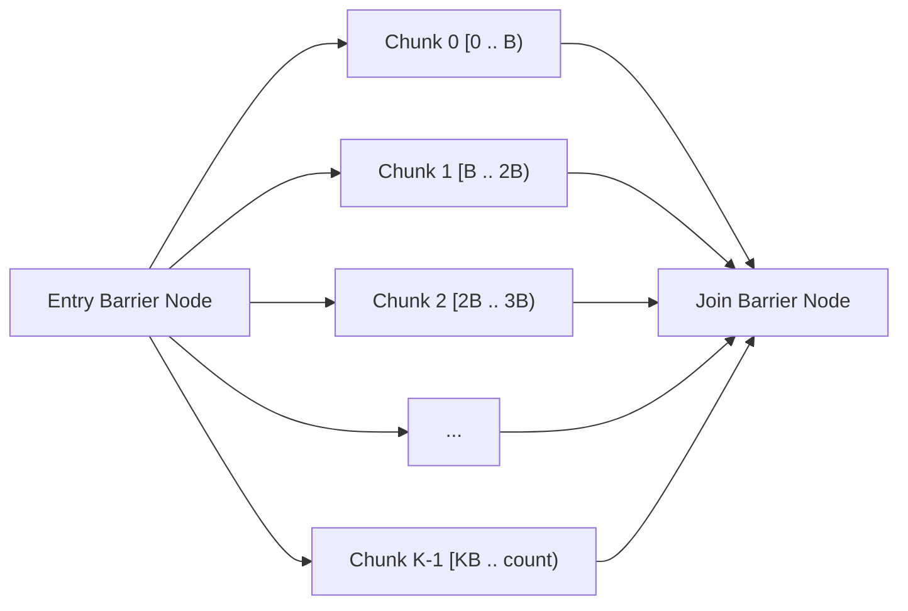

# Data-Parallel Loops (`parallelFor`) API Reference

LightFlow's [`parallelFor`](file:///Users/admin/Work/TEMP/task-scheduler/include/lightflow/task/parallel_for.hpp) provides a cache-conscious, zero-heap-allocation data-parallel loop abstraction directly integrated into the [`TaskGraph`](file:///Users/admin/Work/TEMP/task-scheduler/docs/api/task-graph.md).

---

## Architectural Mechanics

### 1. Automatic Sub-DAG Partitioning
When processing large arrays of elements (e.g., 100,000 GPU mesh instances or 10,000,000 bounding boxes), creating an individual task graph node for every item introduces severe scheduling overhead. `parallelFor` automatically partitions the index domain $[0, \text{count})$ into **contiguous chunks (batches)**:

$$\text{numChunks} = \left\lceil \frac{\text{count}}{\text{batchSize}} \right\rceil$$

It constructs a clean, isolated sub-DAG inside the graph's bump allocator:



* **Entry Barrier Node**: An unconditional barrier that waits for any upstream tasks before unblocking all chunks simultaneously.
* **Chunk Nodes**: Lock-free task nodes placed directly into the scheduler's work-stealing queues.
* **Join Barrier Node**: Holds an `initialInDegree` equal to $\text{numChunks}$. Decrements atomically as each chunk completes. Upstream dependencies chaining off the returned [`ParallelForHandle`](#class-reference-parallelforhandle) wait on this join node.

### 2. Zero Heap Allocation Guarantee
All chunk task nodes, dependency edges, and the shared lambda closure allocate monotonically from the graph's [`SlabArena`](file:///Users/admin/Work/TEMP/task-scheduler/docs/api/memory.md). Zero dynamic heap allocations (`malloc`/`new`) occur, regardless of how many chunks are created.

---

## Method Signatures: `TaskGraph::parallelFor`

```cpp
namespace lf {

// 1. Range-based overload [start, end)
template <typename F>
ParallelForHandle parallelFor(
    const char* name,
    usize count,
    usize batchSize,
    F&& callable,
    TaskDomain domain = TaskDomain::Worker,
    TaskPriority priority = TaskPriority::Normal
);

// 2. Strongly typed std::span slice overload
template <typename T, typename F>
ParallelForHandle parallelFor(
    const char* name,
    std::span<T> slice,
    usize batchSize,
    F&& callable,
    TaskDomain domain = TaskDomain::Worker,
    TaskPriority priority = TaskPriority::Normal
);

// 3. Chunk-indexed dispatch (ByChunk tag)
template <typename F>
ParallelForHandle parallelFor(
    const char* name,
    usize count,
    usize batchSize,
    ByChunkTag,
    F&& callable,
    TaskDomain domain = TaskDomain::Worker,
    TaskPriority priority = TaskPriority::Normal
);

} // namespace lf
```

---

## Supported Callable Invocable Concepts (C++20)

LightFlow uses C++20 concepts (`<lightflow/task/parallel_for.hpp>`) to automatically detect and adapt to your lambda's signature with zero runtime overhead:

### 1. Range Invocable (Best for SIMD / Vector Loops)
Signature: `void(usize start, usize end) noexcept`
```cpp
auto cullPass = graph.parallelFor("ClusterCull", numClusters, 512, 
    [](lf::usize start, lf::usize end) noexcept {
        for (lf::usize i = start; i < end; ++i) {
            cullCluster(i);
        }
    }
);
```

### 2. Range Invocable with Chunk Index
Signature: `void(usize start, usize end, usize chunkIdx) noexcept`
```cpp
auto writePass = graph.parallelFor("ThreadLocalBuffers", count, 1024,
    [](lf::usize start, lf::usize end, lf::usize chunkIdx) noexcept {
        // chunkIdx can index directly into preallocated chunk output buffers
        writeChunkOutput(chunkIdx, start, end);
    }
);
```

### 3. Span Chunk Invocable (Safe Slices)
Signature: `void(std::span<T> chunk) noexcept`
```cpp
std::vector<Particle> particles = ...;

auto simPass = graph.parallelFor("SimulateParticles", std::span{particles}, 256,
    [](std::span<Particle> chunk) noexcept {
        for (Particle& p : chunk) {
            p.pos += p.vel * dt;
        }
    }
);
```

### 4. Span Item Invocable (Automatic Inner Loop)
Signature: `void(T& item) noexcept`
```cpp
// LightFlow automatically synthesizes the inner loop across the chunk slice!
auto transformPass = graph.parallelFor("UpdateTransforms", std::span{transforms}, 1024,
    [](Transform& t) noexcept {
        t.matrix = computeMatrix(t);
    }
);
```

### 5. ChunkRange Invocable
Signature: `void(const ChunkRange& range) noexcept`
```cpp
struct ChunkRange {
    usize start;
    usize end;
    usize chunkIndex;
    usize totalChunks;
    constexpr usize size() const noexcept;
    constexpr bool empty() const noexcept;
};

auto batchPass = graph.parallelFor("BatchWork", totalItems, 512,
    [](const lf::ChunkRange& r) noexcept {
        printf("Running chunk %zu of %zu (range [%zu, %zu))\n", 
               r.chunkIndex, r.totalChunks, r.start, r.end);
    }
);
```

---

## Class Reference: `ParallelForHandle`

`ParallelForHandle` inherits from [`TaskHandle`](file:///Users/admin/Work/TEMP/task-scheduler/docs/api/task-graph.md#class-reference-taskhandle), meaning it transparently participates in dependency chaining.

```cpp
namespace lf {

class ParallelForHandle : public TaskHandle {
public:
    /// Returns the total number of chunks created.
    LF_NODISCARD constexpr usize chunkCount() const noexcept;

    /// Returns a span of pointers to the internal chunk task nodes.
    LF_NODISCARD constexpr std::span<TaskNode*> chunks() const noexcept;

    /// Sets the execution domain across the entry, exit, and all chunk tasks.
    ParallelForHandle domain(TaskDomain d) const noexcept;

    /// Sets the priority level across the entry, exit, and all chunk tasks.
    ParallelForHandle priority(TaskPriority p) const noexcept;
};

} // namespace lf
```

### Chaining with Other Tasks

Because `ParallelForHandle` models a complete sub-DAG with entry and exit barriers:
* Chaining **to** the handle (`upstream.precede(pf)`) adds an edge from `upstream` to the `entry` barrier.
* Chaining **from** the handle (`pf.precede(downstream)`) adds an edge from the `join` barrier to `downstream`.

```cpp
auto uploadData = graph.emplace("UploadGeometry", []() noexcept { /* ... */ });
auto cullPass   = graph.parallelFor("ClusterCull", count, 512, cullFn);
auto renderPass = graph.emplace("RenderScene", []() noexcept { /* ... */ });

// Fluent chaining:
uploadData >> cullPass >> renderPass;
```

---

## Performance Characteristics & Amdahl's Law

Understanding the performance difference between `parallelFor` and full DAG execution:

```
Speedup Multiplier vs Classic ThreadPool
  5.0x |           * (4.64x at 1K items: Classic hits Thundering Herd mutex contention)
  4.0x |          / \
  3.0x |         /   \
  2.0x |   *    /     \     *
  1.0x |───*───/───────\────*──────────────────────────────────── (1.05x Compute Bound)
       +─────────────────────────────────────────────────────────
          100  1K     10K  100K   1M                            10M Items
```

### 1. The 1,000-Item Peak ($4.64\times$ Speedup)
At 1,000 items with `batchSize = 64`, LightFlow creates **16 chunks** (2 chunks per worker core).
* **Classic ThreadPool**: When the submitter notifies the pool, all 8 sleeping threads wake up simultaneously and suffer severe **thundering herd contention** on the single task queue mutex. Total latency balloons to **$44.0\text{ µs}$**.
* **LightFlow**: Workers use lock-free Chase-Lev stealing and adaptive pause-spinning (`_mm_pause`). Workers steal chunks via atomic CAS in nanoseconds without kernel futex sleeps. Total latency is **$9.5\text{ µs}$** ($4.64\times$ faster).

### 2. Large Scale Convergence ($\approx 1.05\times - 1.15\times$ Speedup)
At 10,000,000 items, `batchSize` scales to 4,096 items, producing 2,442 chunks.
* Each chunk contains $40\text{ µs}$ of compute. Total frame time is dominated by mathematical calculations ($> 25\text{ ms}$).
* Scheduling overhead takes $< 0.1\text{ ms}$ for both frameworks.
* **Amdahl's Law**: When 99% of frame time is spent inside the CPU vector ALU, scheduling optimization cannot exceed the theoretical remaining 1% compute boundary.

### Best Practice: Choosing `batchSize`

$$\text{Ideal Batch Size} \approx \frac{\text{L1 Cache Budget (32 KB)}}{\text{Item Size in Bytes}}$$

* For trivial arithmetic (e.g., matrix multiplies, vector adds): `batchSize = 1024` to `4096`.
* For heavier tasks (e.g., ray-triangle intersection, cluster culling): `batchSize = 128` to `512`.
* For IO or command buffer writing: `batchSize = 32` to `64`.
