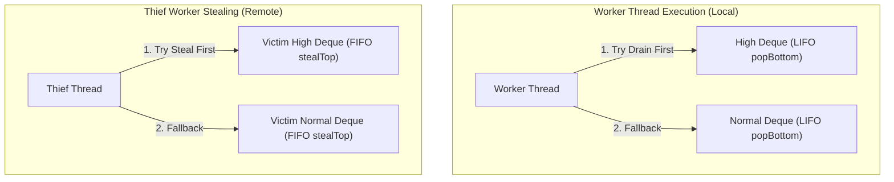

# TaskScheduler & Execution Engine API Reference

The [`TaskScheduler`](../../include/lightflow/scheduler/task_scheduler.hpp) is LightFlow's persistent execution service. It manages worker threads, CPU core affinities, lock-free Chase-Lev work-stealing deques, two-tier adaptive spin-parking, and multi-domain task dispatch.

---

## Architectural Mechanics

### 1. Lock-Free Work-Stealing with Dual-Priority Queues
Each worker thread owns a dedicated, cacheline-aligned [`DualPriorityQueue`](../../include/lightflow/scheduler/chase_lev_deque.hpp) wrapping two Chase-Lev deques:
* **`m_high`**: Critical-path tasks (`TaskPriority::High`).
* **`m_normal`**: Standard tasks (`TaskPriority::Normal`).



* **Worker Operations (LIFO)**: The worker pushes and pops from the bottom of its deque. Operating LIFO preserves hot cache locality for recently spawned sub-tasks.
* **Thief Operations (FIFO)**: Idle thieves steal from the top of the victim's deque via atomic Compare-And-Swap (`CAS`). Operating FIFO steals the oldest, largest units of work (e.g., the top of a tree).

### 2. Multi-Producer External Submissions (MPMC Queue)
When non-worker threads (e.g., networking, audio, or game logic threads) submit tasks into the scheduler, they are enqueued into a bounded **Multi-Producer Multi-Consumer (MPMC) queue** based on Dmitry Vyukov's algorithm. It provides $O(1)$ atomic wait-free enqueue/dequeue, zero heap allocations, and complete ABA immunity.

### 3. Two-Tier Adaptive Spin + Futex Parking
Traditional thread pools waste hundreds of microseconds sleeping and waking up on OS condition variables. LightFlow replaces `std::condition_variable` with a **two-tier adaptive backoff engine**:

1. **Tier 1 (Adaptive Spin-Pause)**:  
   When a worker runs out of work, it spins for a bounded number of iterations (e.g., 64–256 cycles) issuing architecture-optimized pause instructions:
   * x86_64: `_mm_pause()` (relieves pipeline memory order replay penalties).
   * ARM64: `__builtin_arm_yield()` / `__asm__ volatile("yield")`.
2. **Tier 2 (OS Native Futex Sleep)**:  
   If no work is stolen after spinning, the worker parks itself using C++23 `std::atomic<uint32_t>::wait` (backed by Linux `futex`, macOS `__ulock_wait`, or Windows `WaitOnAddress`). When a task unblocks, the submitter wakes workers via `std::atomic<uint32_t>::notify_one()`.

---

## Configuration: `SchedulerConfig`

```cpp
namespace lf {

struct SchedulerConfig {
    /// Number of worker threads. Defaults to std::thread::hardware_concurrency().
    u32 workerCount{0};

    /// Prefix for worker thread names in debuggers and profilers.
    std::string_view threadNamePrefix{"LF-Worker"};

    /// Optional CPU core affinity mapping.
    /// Worker thread i is pinned to coreAffinity[i % coreAffinity.size()].
    std::span<const u32> coreAffinity{};

    /// Initial capacity for each worker's local Chase-Lev ring buffers.
    /// Set >= max simultaneous ready burst tasks (e.g. 131,072) to eliminate growth.
    usize initialDequeCapacity{1024};

    /// Number of dedicated background IO threads.
    u32 ioWorkerCount{1};

    /// Prefix for IO worker thread names.
    std::string_view ioThreadNamePrefix{"LF-IO"};

    /// Optional external timeline device interface for GPU idle polling.
    ITimelineDevice* timelineDevice{nullptr};
};

} // namespace lf
```

---

## Class Reference: `TaskScheduler`

```cpp
namespace lf {
    class TaskScheduler;
}
```

### Constructor & Destructor

```cpp
explicit TaskScheduler(const SchedulerConfig& config = {});
~TaskScheduler();
```
* **Thread Safety**: Spawns worker threads upon construction. Safely drains and joins all worker and IO threads upon destruction.
* **Allocation Guarantee**: All worker context structures, Chase-Lev ring buffers, and queues are pre-allocated during construction. **Zero heap allocations occur during runtime scheduling.**

---

### Graph Execution Methods

```cpp
/// Submits graph and blocks the calling thread until all tasks complete.
Status runAndWait(TaskGraph& graph);

/// Submits graph asynchronously for background execution.
void submit(TaskGraph& graph);

/// Blocks until the previously submitted graph finishes execution.
Status wait(TaskGraph& graph);
```

#### Return Status: `lf::Status`
```cpp
enum class Status : u8 {
    Success = 0,
    Timeout,
    Cancelled,
    Error
};
```

---

### Main Thread Task Draining

```cpp
usize drainMainThreadTasks();
```
Executes all tasks tagged with [`TaskDomain::MainThread`](#execution-domains-taskdomain) currently pending in the main thread queue.

* **Context**: Must be called from your engine's main thread (e.g., during window message pumping or OpenGL/Vulkan swapchain present).
* **Returns**: Number of tasks executed.
* **Example**:
  ```cpp
  while (!engineShouldClose) {
      // 1. Drain task-graph tasks that must execute on the OS main thread
      scheduler.drainMainThreadTasks();

      // 2. Poll OS events
      glfwPollEvents();
  }
  ```

---

### Introspection & Thread Queries

```cpp
/// Returns true if the calling thread is an active LightFlow worker thread.
LF_NODISCARD static bool isWorkerThread() noexcept;

/// Returns total number of worker threads in the scheduler pool.
LF_NODISCARD u32 workerCount() const noexcept;

/// Returns the zero-based index of the calling worker thread [0, workerCount).
LF_NODISCARD static u32 currentWorkerIndex() noexcept;
```

---

## Execution Domains: `TaskDomain`

```cpp
enum class TaskDomain : u8 {
    Worker = 0,   // Standard work-stealing pool (CPU intensive)
    MainThread,   // OS main thread only (Windowing, GUI, Swapchain)
    IO            // Dedicated background IO thread pool (Disk/Asset streaming)
};
```

Tasks specify their target domain during creation:
```cpp
// Executed by worker threads via work stealing:
auto workerTask = graph.emplace("CullEntities", cullFn, lf::TaskDomain::Worker);

// Guaranteed to execute on the main thread when drainMainThreadTasks() is called:
auto presentTask = graph.emplace("SwapchainPresent", presentFn, lf::TaskDomain::MainThread);

// Executed by background streaming threads without stalling rendering workers:
auto streamTask = graph.emplace("LoadTextureChunk", diskFn, lf::TaskDomain::IO);
```

---

## Priority Scheduling: `TaskPriority`

```cpp
enum class TaskPriority : u8 {
    Normal = 0,
    High = 1
};
```

* Tasks with `TaskPriority::High` are pushed to the worker's `m_high` deque.
* Both local workers and remote thieves **strictly drain high-priority tasks first** before processing any normal-priority tasks.
* **Use Case**: Critical-path rendering stages (e.g., early shadow map dispatch or occlusion culling readbacks) that bottleneck subsequent passes.

---

## Systems Architecture: Memory & Cache Alignment

```cpp
struct alignas(lf::CACHELINE_SIZE) WorkerThreadContext {
    DualPriorityQueue queue;           // 64-byte aligned Chase-Lev queues
    SlabArena localArena;              // Thread-local 64KB bump arena
    std::atomic<u32> state;            // Spinning / Parked state
    char pad[...];                     // Zero false sharing guaranteed
};
```
Every `WorkerThreadContext` is padded to `alignas(64)` bytes, guaranteeing that concurrent work-stealing attempts between adjacent cores never trigger CPU L1 cache invalidations.
